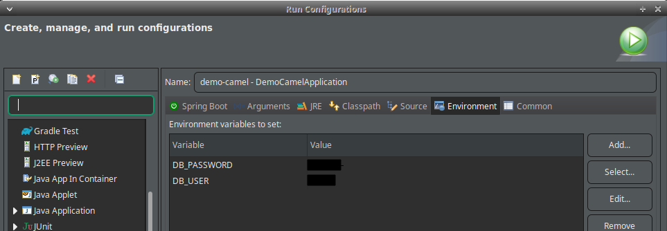

# Apache Camel project integrating with MySql

> System integration:
>
> Rest API to JDBC
>

- O comando abaixo cria o arquivo '.env' baseado no .env.example, depois preencha o valor das variáveis

```bash
cat .env.example > .env
```

- Execute o docker-compose para criar e executar um cantainer com o banco de dados

```bash
docker-compose up -d
```

- Se for executar o projeto apartir do jar, exporte primeiro as variáveis (no Linux)

```bash
export $(cat .env | xargs)
```

- Se for executar pela IDE, setar as variaveis em Run Configurations > environment



- Listar os usuários (GET)

```
http://localhost:8080/users
```

- Adicionar um novo usuário (numa lista - porque posso adicionar mais de um ao mesmo tempo) (POST)

```
http://localhost:8080/users
```

- Body (json)

```
[{
    "nome": "Anna Carolina"
}]
```
